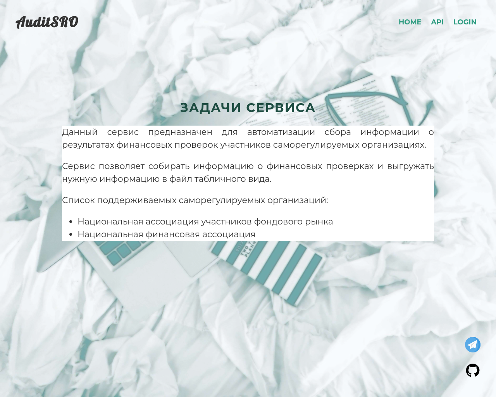

# AuditSRO

Сервис мониторинга финансовых проверок в саморегулируемых организациях.

[Техническое задание](./docs/technical_requirements.md)  
[Схема взаимодействия](./docs/interaction_scheme.md)  
[Планы по развитию](./docs/TODO.md)

___

## Иллюстрация web страниц




---
## Для запуска скрапера необходимо
1. Перейти в директорию `./DjangoAuditSRO/scraper/`.
2. Вызвать паука по имени и передать путь к файлу результатов
```shell
scrapy crawl naufor -O ../tmp/naufor.csv
```
