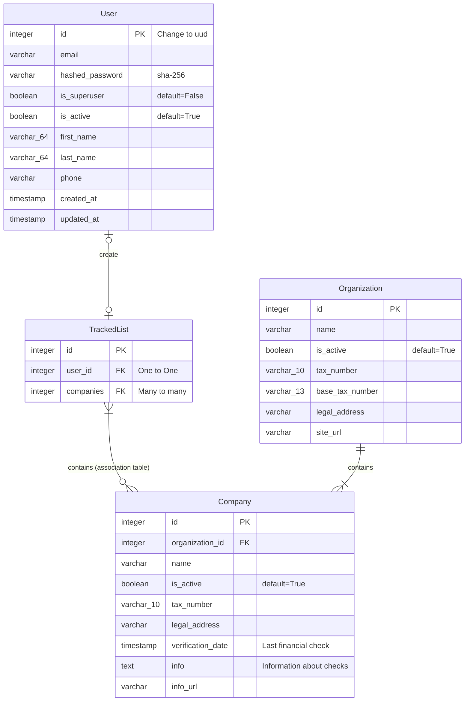

```mermaid
erDiagram
    User |o--o| TrackedList : create
    User {
        integer id PK "Change to uud"
        varchar email
        varchar hashed_password "sha-256"
        boolean is_superuser "default=False"
        boolean is_active "default=True"
        varchar_64 first_name
        varchar_64 last_name
        varchar phone
        timestamp created_at
        timestamp updated_at 
    }
    
    TrackedList }|--o{ Company : "contains (association table)"
    TrackedList {
        integer id PK
        integer user_id FK "One to One"
        integer companies FK "Many to many"
    }
    
    Organization ||--|{ Company : contains
    Organization {
        integer id PK
        varchar name
        boolean is_active "default=True"
        varchar_10 tax_number
        varchar_13 base_tax_number
        varchar legal_address
        varchar site_url
    }
    
    Company {
        integer id PK
        integer organization_id FK
        varchar name
        boolean is_active "default=True"
        varchar_10 tax_number
        varchar legal_address
        timestamp verification_date "Last financial check"
        text info "Information about checks"
        varchar info_url
    }
```